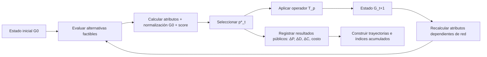
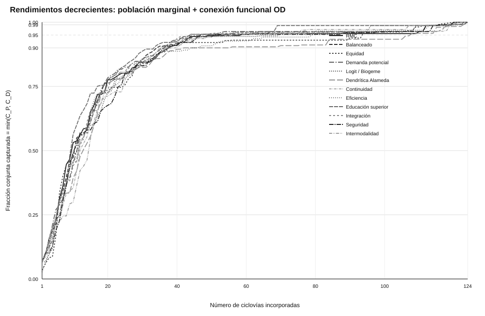
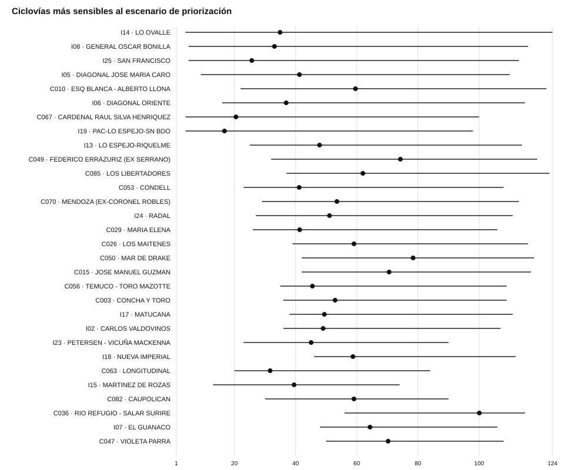
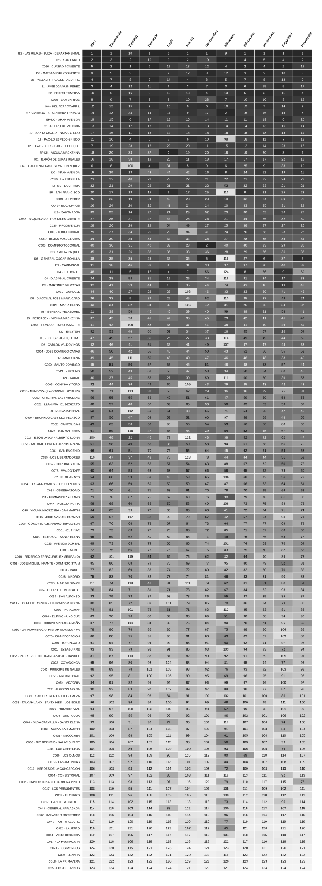
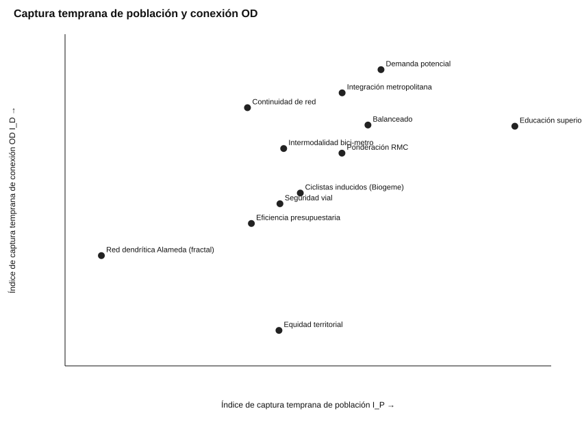

# Suplemento técnico y reproducible del paper EVA

## Evaluación de trayectorias de implementación en redes de transporte: método EVA para la secuenciación dependiente del estado

**Autores:** Ariel López y Gabriela Bastías  
**Fecha de corte de esta documentación:** 2026-09-04  
**Repositorio:** `arieIIopez/eva`  
**Uso previsto:** material de profundización para lectores, revisores y replicadores del artículo remitido a *Revista Estudios de Transporte (EDTR)*.

> **Regla de autoridad de resultados.** Para las cifras del experimento principal de doce escenarios, la fuente autoritativa es el conjunto `results/paper-all-scenarios-benefits/` regenerado después de unificar la definición de red efectiva y persistido por GitHub Actions en el commit `376a5e355d7086371fa89ca827262c7c089e4897`. Las cifras topológicas anteriores que reportaban 105 componentes finales, `I_C≈0,8766` o valores derivados de una red inicial distinta deben considerarse históricas y no deben emplearse para reproducir las tablas o conclusiones actuales del paper.

---

## 1. Propósito de este suplemento

El artículo principal es deliberadamente compacto. Este documento expone el cálculo con una profundidad que no cabe dentro del límite editorial: define los objetos matemáticos, explica cómo el código transforma el estado de red, documenta las referencias de normalización, reproduce los perfiles de ponderación, describe cada experimento, explicita las fórmulas de los indicadores, señala dónde se almacenan los resultados y conecta cada hallazgo con sus archivos reproducibles.

El objetivo es que un revisor pueda responder, sin depender de una “caja negra”, preguntas como:

1. ¿Qué exactamente significa que EVA sea dependiente del estado?
2. ¿Qué cambia y qué permanece fijo después de implementar un proyecto?
3. ¿Cómo se calcula el score y cómo se evita confundir dependencia del estado con cambios del denominador de normalización?
4. ¿Cómo se construyen las trayectorias de población, habilitación OD y conectividad?
5. ¿Cómo se calculan `A_P`, `I_P`, `A_D`, `I_D`, `A_C` e `I_C`?
6. ¿Qué diferencia existe entre captura temprana, saturación práctica y suficiencia objetivo-específica?
7. ¿Cómo se calcula una interacción dirigida `I_t(p,q)` y un efecto de orden?
8. ¿Cómo se compara un ranking estático con una secuencia reevaluada?
9. ¿Cómo se determina una frontera de Pareto entre perfiles de política?
10. ¿Qué archivos permiten reconstruir cada cifra del manuscrito?

La bibliografía completa en APA 7 con DOI enlazado está en [REFERENCIAS_APA_DOI.md](./REFERENCIAS_APA_DOI.md).

---

## 2. Arquitectura conceptual del cálculo

EVA trata la implementación de un plan maestro como una secuencia de transformaciones del sistema, no como una lista cuyo valor queda fijado una vez en el estado inicial.



El objeto básico es el estado de red:

$$
G_t=(V_t,E_t,A_t)
$$

con nodos `V_t`, arcos `E_t` y atributos `A_t`. Un proyecto `p` se representa como un operador de transformación:

$$
T_p:G_t\rightarrow G_{t+1}
$$

La secuencia de implementación produce:

$$
G_0\rightarrow G_1\rightarrow \cdots \rightarrow G_k
$$

La idea central no es que la secuencia sea novedosa en sí misma —la literatura de diseño de redes, inversión multiperíodo, planificación adaptativa e interdependencia ya la aborda—, sino que EVA articula en una misma arquitectura auditable: estado, factibilidad, preferencias, normalización, transformación y resultados públicos. Véanse, entre otros, Asadi Bagloee y Asadi (2015), Chow et al. (2011), Paulsen y Rich (2023, 2024), Yoon y Chow (2024) y Yu et al. (2026), todos con DOI en la [bibliografía](./REFERENCIAS_APA_DOI.md).

---

## 3. Snapshot reproducible y jerarquía de fuentes

### 3.1 Versiones

| Elemento | Versión / identificador |
|---|---:|
| Release pública citable | EVA `v3.12.1` |
| Motor estable asociado | `v3.12.0` |
| Datos | `2026.08` |
| Metodología pública | `v2.3.0` |
| DOI release pública | https://doi.org/10.5281/zenodo.22145509 |
| Snapshot de resultados principales del paper | commit `376a5e355d7086371fa89ca827262c7c089e4897` |
| Cursor documental vigente | `docs/paper/CURRENT_STATE_EDTR_2026-09-04.md` |

**Importante:** a la fecha de este corte no existe una release pública `v3.13.0`. Los experimentos del artículo corresponden a desarrollo posterior a `v3.12.1` y se identifican mediante commit reproducible.

### 3.2 Archivos que gobiernan el experimento principal

| Función | Archivo |
|---|---|
| Definición común de red efectiva | `experiments/effective-network.js` |
| Evaluación de 12 escenarios | `experiments/paper-all-scenarios-benefits.js` |
| Capa científica de normalización fija y diagnósticos | `experiments/paper-experiments-fast.js` |
| Perfiles de ponderación | `src/scenarios.jsx` |
| Runner Playwright | `scripts/run-paper-all-scenarios-benefits.mjs` |
| Postproceso 12 escenarios | `scripts/analyze-paper-all-scenarios.py` |
| Saturación P–OD | `scripts/analyze-saturation-population-od.py` |
| CI reproducible | `.github/workflows/paper-all-scenarios-benefits.yml` |
| Resultados autoritativos | `results/paper-all-scenarios-benefits/` |

### 3.3 Cadena reproducible en GitHub Actions

El workflow instala Node 20 y Playwright 1.48.2, inicia un servidor local con `python3 -m http.server 8080`, ejecuta Chromium en modo headless, corre los doce escenarios, postprocesa rankings/fronteras/saturación y persiste los resultados en `main` si hay cambios.

Una reproducción local equivalente puede seguir esta secuencia desde la raíz del repositorio:

```bash
npm install --no-save playwright@1.48.2
npx playwright install chromium
python3 -m http.server 8080

# En otra terminal:
EVA_EXPERIMENT_BASE_URL=http://127.0.0.1:8080/experiments/runner-all-scenarios-benefits.html \
  node scripts/run-paper-all-scenarios-benefits.mjs

python3 scripts/analyze-paper-all-scenarios.py
python3 scripts/analyze-saturation-population-od.py
```

Para una reproducción estricta del paper, debe usarse el commit congelado o una release posterior que explícitamente declare equivalencia con ese snapshot.

---

## 4. Universo de análisis y construcción de `G_0`

### 4.1 Cartera

La fuente de proyectos contiene **133 proyectos modelados**. El conjunto factible científico utilizado en el experimento principal incluye únicamente proyectos cuya escala es `Comunal` o `Intercomunal`:

$$
|P_0^f|=88+36=124
$$

Los **9 corredores metropolitanos (MET)** permanecen en el universo modelado, pero se excluyen de:

- la competencia por prioridad;
- el cálculo de referencias máximas de normalización;
- la secuencia ejecutada del experimento.

Esta decisión evita que alternativas que no son materia de decisión en el mismo ejercicio alteren los denominadores o el ranking de las alternativas elegibles.

### 4.2 Red existente efectiva

La fuente de red existente contiene **601 ejes**. En el perfil científico `general`, `experiments/effective-network.js` excluye los tipos normalizados:

- `piloto`;
- `zona30`;
- `otro`.

Se excluyen **25 ejes**, por lo que la red efectiva contiene:

$$
601-25=576\text{ ejes}
$$

Esta red efectiva se asigna a `window.existingFC` **antes** de que los distintos módulos experimentales calculen componentes, accesibilidad, topología o demanda. Esta unificación cerró una inconsistencia detectada durante el QA: módulos distintos no podían observar definiciones diferentes de `G_0`.

### 4.3 Componentes conexos

Con tolerancia de conexión por defecto `connectTol=150 m`, la red efectiva inicial tiene:

$$
C(G_0)=142\text{ componentes}
$$

Tras ejecutar los mismos 124 proyectos en cualquiera de los doce escenarios, el estado físico final común posee:

$$
C(G_{124})=107
$$

Por tanto, la reducción final común es:

$$
\Delta C_H=142-107=35\text{ componentes}
$$

La igualdad del estado final es una propiedad deliberada del diseño experimental: **cada escenario ejecuta exactamente la misma cartera física completa; cambia el orden, no el conjunto final**.

---

## 5. Datos territoriales y reglas espaciales principales

La aplicación empírica usa **1.589 hexágonos** de aproximadamente 600 m que agregan población ocupada y destinos laborales. En la configuración del paper:

- distancia de acceso al sistema: `700 m`;
- distancia de conexión geométrica entre muestras de ejes: `150 m`;
- una subred “sirve” una comuna destino cuando cubre al menos `40%` de los ocupados modelados de esa comuna dentro del criterio operacional definido;
- se evalúan los diez principales destinos laborales del hexágono;
- el costo de inversión es un **proxy**, por defecto longitud × 100 MCLP/km, no una estimación presupuestaria de ingeniería de detalle.

### 5.1 Población marginal

`p.poblacion` no representa población total ni personas ya cubiertas. En cada estado es el número de **ocupados modelados que adquieren nuevo acceso respecto del estado precedente** gracias al candidato.

Conceptualmente:

$$
\Delta P_t(p\mid G_t)=\sum_h ocup_h\;\mathbb{1}\{h\text{ pasa de no cubierto a cubierto por }T_p(G_t)\}
$$

El acumulado de una secuencia `π` es:

$$
P_t(\pi)=\sum_{s=1}^{t}\Delta P_s(\pi)
$$

El valor final común del experimento completo es **600.177 ocupados con nuevo acceso respecto de `G_0`**.

### 5.2 Habilitación OD

`demandaHabilitada` es un proxy de conexión funcional. Un viaje OD se cuenta cuando pasa de no viable en `G_t` a viable después de incorporar el proyecto. No es ruteo puerta a puerta ni una medición causal de viajes realizados.

$$
\Delta D_t(p\mid G_t)=\sum_{(o,d)}f_{od}\;\mathbb{1}\{(o,d)\text{ no viable en }G_t\land\text{ viable en }T_p(G_t)\}
$$

El acumulado es:

$$
D_t=\sum_{s=1}^{t}\Delta D_s
$$

Por la resolución entera del registro de ganancias OD, algunas secuencias completas terminan a uno o pocos viajes de diferencia entre sí; ello no cambia la interpretación del orden de magnitud ni el análisis de trayectoria.

### 5.3 Conectividad topológica

Sea `N_t` el número de componentes del estado después de la etapa `t`. La reducción acumulada respecto de `G_0` es:

$$
C_t=N_0-N_t
$$

`C_t` **no es necesariamente monótono**: una intervención puede crear temporalmente un componente aislado antes de que una intervención posterior lo conecte. Por eso el artículo no interpreta `I_C` como una “proporción monotónica capturada temprano”, sino como un índice normalizado de la trayectoria topológica.

---

## 6. Función de evaluación multicriterio

La formulación general distingue atributos intrínsecos, relacionales, topológicos y habilitantes:

$$
S_t^0(p)=F\!\left(X_p^I,X_{p,t}^R,X_{p,t}^T,X_{p,t}^H;\Omega,W,\Theta\right)
$$

Equivalentemente:

$$
S_t^0(p)=S^0\!\left(p\mid G_t,\Omega,W,\Theta\right)
$$

En la aplicación EVA el score ponderado es:

$$
S_t(p)=\frac{\sum_i w_i\hat{x}_{i,p,t}}{\sum_i w_i}
$$

`monumentos` es informativo y se fija con peso 0, por lo que se excluye materialmente del denominador.

### 6.1 Criterios activos

La capa de escenarios maneja 16 claves:

| Clave | Interpretación operacional en EVA |
|---|---|
| `poblacion` | población ocupada marginal con nuevo acceso |
| `costoOD` | clave histórica; tasa/discretización de habilitación OD, **no costo generalizado** en el motor vigente |
| `oportunidades` | unidades territoriales/hexágonos beneficiados |
| `equidad` | señal normalizada de equidad territorial |
| `continuidad` | continuidad/conexión de subredes |
| `demanda` | volumen de demanda OD habilitada |
| `ciclistas` | ciclistas inducidos estimados por el modelo logit Biogeme |
| `fractal` | coherencia con la estrategia dendrítica/topológica |
| `estudiantes` | generación/acceso asociado a educación superior |
| `prioridadGore` | prioridad regional precalificada |
| `costoInv` | eficiencia de costo mediante inverso normalizado |
| `seguridad` | siniestralidad ciclista prevenible ponderada |
| `monumentos` | atributo informativo; peso 0 |
| `intermodal` | intermodalidad bici–Metro |
| `factibilidad` | proxy espacial basado en número de pistas |
| `parques` | atractor de parques por superficie |

Las fichas operacionales y ecuaciones sectoriales más específicas se mantienen en `src/metodologia.jsx`. Para el paper, la capa experimental **no redefine** esas métricas: las consume y controla cómo se normalizan y combinan.

---

## 7. Normalización científica fija en `G_0`

La aplicación operacional de EVA puede normalizar respecto del conjunto activo. Esa convención es útil interactivamente, pero en un experimento de dependencia del estado genera una confusión: eliminar el proyecto que define un máximo cambia el denominador aunque el atributo bruto de otro proyecto no haya variado.

Para aislar el efecto del estado de red, el paper fija una referencia en `G_0`:

$$
\hat{x}_{i,p,t}^{G_0}=\frac{x_{i,p,t}}{M_{i,0}}
$$

con `M_{i,0}` calculado una sola vez sobre los **124 elegibles**. Si un atributo bruto crece posteriormente por encima del máximo inicial, su valor normalizado puede superar 1. Esto es intencional: la escala es una referencia fija, no un truncamiento.

Para las variables ya expresadas como índices o con transformaciones especiales, el código conserva su forma específica. En particular:

$$
\hat{x}_{costo,p,t}=1-\frac{costo_p}{M_{costo,0}}
$$

La estrategia dendrítica usa base teórica 100:

$$
\hat{x}_{fractal,p,t}=\frac{scorePrioridad_{p,t}}{100}
$$

### 7.1 Constantes exactas de normalización

Fuente: `results/paper-all-scenarios-benefits/normalization_reference.json`.

| Criterio | `M_{i,0}` / referencia |
|---|---:|
| población | 54.569 |
| costoOD | 12 |
| oportunidades | 105 |
| demanda habilitada | 58.232 |
| ciclistas inducidos | 271 |
| estudiantes | 12.189 |
| seguridad | 52,13 |
| monumentos | 21 |
| intermodal | 6 |
| factibilidad | 3,9 |
| parques | 780.968 |
| costo | 1.435 MCLP |
| fractal | 100 |

`equidad`, `continuidad` y `prioridadGore` se consumen como índices/preparaciones propias según el motor, no mediante los máximos anteriores.

---

## 8. Los doce perfiles de política `W`

Los doce perfiles no son un muestreo exhaustivo del simplex de ponderaciones: son configuraciones predefinidas de EVA. Once comparten un piso contextual de pesos bajos y elevan el foco temático; **Ponderación RMC** conserva el vector institucional provisto.

Abreviaturas: `Pob` población; `cOD` costoOD; `Opo` oportunidades; `Eq` equidad; `Con` continuidad; `Dem` demanda; `Cic` ciclistas; `Fra` fractal; `Est` estudiantes; `GORE` prioridadGore; `Cost` costoInv; `Seg` seguridad; `Mon` monumentos; `Int` intermodal; `Fact` factibilidad; `Par` parques.

| Escenario | Pob | cOD | Opo | Eq | Con | Dem | Cic | Fra | Est | GORE | Cost | Seg | Mon | Int | Fact | Par |
|---|---:|---:|---:|---:|---:|---:|---:|---:|---:|---:|---:|---:|---:|---:|---:|---:|
| Ponderación RMC | 28 | 18 | 14 | 18 | 19 | 13 | 28 | 30 | 12 | 24 | 15 | 5 | 0 | 9 | 15 | 20 |
| Balanceado | 14 | 10 | 6 | 12 | 12 | 12 | 10 | 6 | 5 | 10 | 6 | 5 | 0 | 8 | 8 | 6 |
| Equidad territorial | 16 | 8 | 6 | 40 | 10 | 10 | 8 | 6 | 5 | 22 | 6 | 5 | 0 | 5 | 5 | 4 |
| Demanda potencial | 14 | 22 | 6 | 10 | 10 | 35 | 14 | 6 | 5 | 8 | 6 | 5 | 0 | 5 | 5 | 4 |
| Ciclistas inducidos | 12 | 8 | 6 | 10 | 12 | 16 | 45 | 6 | 5 | 8 | 6 | 5 | 0 | 8 | 5 | 4 |
| Dendrítica Alameda | 12 | 8 | 6 | 10 | 18 | 12 | 10 | 45 | 5 | 8 | 6 | 5 | 0 | 5 | 5 | 4 |
| Continuidad de red | 12 | 12 | 6 | 10 | 40 | 14 | 8 | 14 | 5 | 8 | 6 | 5 | 0 | 5 | 5 | 4 |
| Eficiencia presupuestaria | 18 | 8 | 6 | 10 | 10 | 12 | 8 | 6 | 5 | 8 | 35 | 5 | 0 | 5 | 20 | 4 |
| Educación superior | 14 | 8 | 6 | 10 | 10 | 12 | 8 | 6 | 40 | 8 | 6 | 5 | 0 | 8 | 5 | 4 |
| Integración metropolitana | 12 | 20 | 6 | 14 | 25 | 18 | 8 | 10 | 5 | 18 | 6 | 5 | 0 | 15 | 5 | 4 |
| Seguridad vial | 14 | 8 | 6 | 12 | 14 | 10 | 8 | 6 | 5 | 8 | 6 | 35 | 0 | 5 | 5 | 4 |
| Intermodalidad bici–Metro | 12 | 12 | 6 | 10 | 14 | 14 | 8 | 6 | 5 | 8 | 6 | 5 | 0 | 35 | 5 | 4 |

Fuente de verdad: `src/scenarios.jsx`.

---

## 9. Algoritmo secuencial principal

En cada escenario se aplica la misma heurística voraz dependiente del estado. No se afirma que resuelva el óptimo global.

$$
p_t^*=\arg\max_{p\in P_t^f}S_t(p)
$$

$$
G_{t+1}=T_{p_t^*}(G_t)
$$

### 9.1 Pseudocódigo exacto a nivel metodológico

```text
ENTRADAS:
  red existente efectiva G0
  cartera elegible P0f (124 proyectos)
  vector de pesos W
  parámetros Θ
  estrategia topológica Ω = Alameda, tau=100, alpha=0.5
  escalas de normalización M_i,0 calculadas en G0

locked = []
para t = 1 ... 124:
    1. reconstruir/evaluar el estado con los proyectos en locked
    2. obtener atributos de cada proyecto elegible no ejecutado
    3. normalizar cada atributo usando la referencia fija M_i,0
    4. calcular S_t(p) para cada candidato
    5. ordenar por score descendente
       empate -> id de proyecto en orden lexicográfico
    6. seleccionar p*_t = primer candidato
    7. agregar su geometría a locked
    8. recalcular número de componentes de la red
    9. registrar:
       - score
       - ΔP_t
       - población beneficiada auxiliar
       - ΔD_t
       - ciclistas inducidos
       - componentes
       - costo proxy
       - acumulados
fin
```

La regla de desempate determinista evita que empates numéricos generen secuencias no reproducibles entre ejecuciones.

---

## 10. Medición de la trayectoria

### 10.1 Área bajo la trayectoria

Para un resultado acumulado `Y_t`:

$$
A_Y(\pi)=\sum_{t=1}^{k}Y_t(\pi)
$$

Para población:

$$
A_P=\sum_{t=1}^{k}P_t
$$

Para OD:

$$
A_D=\sum_{t=1}^{k}D_t
$$

Para conectividad:

$$
A_C=\sum_{t=1}^{k}C_t
$$

Estas áreas tienen unidades “resultado-etapa”: ocupado-etapa, viaje-etapa y componente-etapa.

### 10.2 Índice normalizado de trayectoria

Si `Y_k>0`:

$$
I_Y=\frac{A_Y}{kY_k}
$$

Cuando dos escenarios tienen el mismo `k` y mismo `Y_k`, maximizar `I_Y` equivale a maximizar `A_Y`.

Para población y OD, que son acumulados monótonos, un índice mayor implica que una mayor parte del resultado final aparece antes. Para conectividad, `I_C` se usa como integral normalizada, con la cautela ya señalada sobre posibles retrocesos transitorios de `C_t`.

### 10.3 Etapa media ponderada

El código calcula además:

$$
\bar{t}_Y=\frac{\sum_t t\,\max(0,\Delta Y_t)}{Y_k}
$$

Una `\bar{t}` menor corresponde, bajo esta definición, a ganancias marginales concentradas más temprano.

---

## 11. Saturación práctica conjunta P–OD

Se normalizan los acumulados por su horizonte final:

$$
C_{P,W}(t)=\frac{P_t}{P_H}
$$

$$
C_{D,W}(t)=\frac{D_t}{D_H}
$$

La cobertura conjunta conservadora es:

$$
C_{PD,W}(t)=\min\{C_{P,W}(t),C_{D,W}(t)\}
$$

Para un umbral `γ`:

$$
t_W^{(\gamma)}=\min\{t:C_{PD,W}(t)\ge\gamma\}
$$

El paper utiliza principalmente `γ=0,95`, y también reporta 99%.

> **Interpretación correcta:** alcanzar 95% temprano muestra **concentración temprana** seguida de una cola de captura lenta. No demuestra, por sí solo, rendimientos marginales decrecientes en sentido económico ni beneficio marginal cero. Esa segunda afirmación requiere la prueba de suficiencia descrita en la sección 14.



---

## 12. Resultados autoritativos de los doce escenarios

Fuente: `results/paper-all-scenarios-benefits/scenario_benefit_summary.csv`.

| Escenario | `A_P` | `I_P` | `A_D` | `I_D` | `A_C` | `I_C` | 95% P–OD | 99% P–OD |
|---|---:|---:|---:|---:|---:|---:|---:|---:|
| RMC | 64.232.198 | 0,8631 | 97.345.906 | 0,9008 | 3.610 | 0,8318 | 59 | 120 |
| Balanceado | 64.498.446 | 0,8667 | 97.774.536 | 0,9048 | 3.734 | 0,8604 | 47 | 118 |
| Equidad | 63.587.218 | 0,8544 | 94.643.778 | 0,8758 | 3.450 | 0,7949 | 94 | 116 |
| Demanda | 64.632.076 | 0,8685 | **98.618.436** | **0,9126** | 3.746 | 0,8631 | 48 | 118 |
| Ciclistas | 63.805.634 | 0,8573 | 96.737.645 | 0,8952 | 3.607 | 0,8311 | 70 | 119 |
| Dendrítica Alameda | 61.768.947 | 0,8300 | 95.784.424 | 0,8863 | 3.645 | 0,8399 | 108 | 123 |
| Continuidad | 63.264.851 | 0,8501 | 98.039.146 | 0,9072 | **3.909** | **0,9007** | 57 | 119 |
| Eficiencia | 63.304.804 | 0,8506 | 96.273.884 | 0,8909 | 3.526 | 0,8124 | 80 | 122 |
| Educación | **66.002.593** | **0,8869** | 97.756.462 | 0,9046 | 3.599 | 0,8293 | 44 | 117 |
| Integración | 64.234.047 | 0,8631 | 98.265.142 | 0,9093 | 3.797 | 0,8749 | 44 | 118 |
| Seguridad | 63.597.343 | 0,8546 | 96.574.864 | 0,8937 | 3.666 | 0,8447 | 51 | 116 |
| Intermodal | 63.635.607 | 0,8551 | 97.416.515 | 0,9014 | 3.709 | 0,8546 | 53 | 118 |

Todos terminan con **600.177 ocupados de ganancia acumulada de acceso**, **107 componentes**, reducción final de **35 componentes** y costo proxy acumulado de **43.887 MCLP**. Las diferencias son de trayectoria.

Resultados usados en el resumen del paper:

- Educación superior: `I_P≈0,887`;
- Demanda potencial: `I_D≈0,913`;
- Continuidad de red: `I_C≈0,901`.

---

## 13. Robustez de posiciones frente a `W`

Para cada proyecto `i` y escenario `W` se registra su posición secuencial `r_i(W)`. Se calculan:

$$
R_i=\max_W r_i(W)-\min_W r_i(W)
$$

más media, mediana, desviación estándar poblacional y frecuencia Top-10/20/30.

Resultados principales:

- 90 de 124 proyectos cambian más de 20 posiciones;
- 37 cambian más de 50;
- 17 cambian más de 75;
- 4 cambian más de 100;
- I12 permanece Top-10 en 12/12 escenarios;
- I26 es Top-10 en 11/12;
- I16, I30 y C068 son Top-10 en 10/12;
- I14 Lo Ovalle recorre de posición 4 a 124, rango 120.



La matriz completa 124×12 puede auditarse visualmente aquí:



Archivo numérico: `results/paper-all-scenarios-benefits/project_rank_variability.csv`.

---

## 14. Suficiencia objetivo-específica: Population-first

El experimento Population-first responde una pregunta diferente a la saturación práctica: ¿en qué momento deja de existir ganancia poblacional directa y además no existe una intervención de beneficio cero que habilite ganancia en el paso siguiente?

Beneficio directo:

$$
B_t^P(p)=\Delta P_t(p\mid G_t)
$$

Habilitación a un paso:

$$
H_t^P(p)=\max_{q\in P_{t+1}^f(p)}\Delta P_{t+1}\!\left(q\mid T_p(G_t)\right)
$$

Con umbral `ε=0`, se detiene si:

$$
\max_{p\in P_t^f}B_t^P(p)\le 0
$$

y

$$
\max_{p\in P_t^f}H_t^P(p)\le 0
$$

### 14.1 Algoritmo

```text
mientras existan proyectos remanentes:
    evaluar ΔP directo de todos
    si max ΔP > 0:
        seleccionar el proyecto con mayor ΔP
    si todos ΔP <= 0:
        para cada proyecto p remanente:
            simular temporalmente T_p(G_t)
            recalcular todos los restantes
            medir el mejor ΔP disponible en t+1
        si algún p habilita ΔP > 0:
            seleccionar el mejor habilitador
        en otro caso:
            detener
```

### 14.2 Resultado reproducido

Fuente: `results/paper-population-first-only/population_first_summary.csv`.

| Métrica | Valor |
|---|---:|
| Proyectos elegibles | 124 |
| Ejecutados hasta suficiencia | **42** |
| Remanentes | **82** |
| Población ocupada acumulada con nuevo acceso | **600.177** |
| Fracción de la referencia final | 1,000000 |
| `A_P` sobre horizonte común 124 | **68.838.193** ocupado-etapa |
| `I_P` | **0,924972** |
| 50% | etapa 8 |
| 75% | 15 |
| 90% | 23 |
| 95% | 28 |
| 99% | 35 |
| Habilitadores de un paso efectivamente ejecutados | **0** |
| Costo proxy al detenerse | 20.631 MCLP |

Para comparar una trayectoria detenida con trayectorias de 124 etapas, el acumulado `P_t` se mantiene constante desde `t*=42` hasta 124 al calcular el área. Esto evita premiar artificialmente una serie por ser más corta.

**No debe interpretarse:** que los 82 proyectos sean inútiles, redundantes o socialmente no rentables. Sólo se demuestra suficiencia respecto de **esta métrica de nuevo acceso poblacional** y **este horizonte de habilitación de un paso**.

---

## 15. Suficiencia objetivo-específica: OD-first

Se reemplaza `ΔP` por demanda OD habilitada:

$$
B_t^D(p)=\Delta D_t(p\mid G_t)
$$

$$
H_t^D(p)=\max_{q\in P_{t+1}^f(p)}\Delta D_{t+1}\!\left(q\mid T_p(G_t)\right)
$$

Resultado desde `results/paper-od-first-only/od_first_summary.csv`:

| Métrica | Valor |
|---|---:|
| Proyectos elegibles | 124 |
| Ejecutados | **52** |
| Remanentes | **72** |
| OD habilitado al detenerse | **871.510 viajes/día** |
| Referencia completa | 871.511 |
| Fracción | 0,99999885 |
| Área sobre horizonte 124 | **99.097.405 viaje-etapa** |
| Índice de captura | **0,916134** |
| 50% | etapa 8 |
| 75% | 14 |
| 90% | 25 |
| 95% | 33 |
| 99% | 44 |
| Habilitadores de un paso ejecutados | **0** |
| Población acumulada al detenerse | 579.441 |
| Costo proxy al detenerse | 25.896 MCLP |

La diferencia de un viaje frente a la referencia se atribuye a la resolución entera con que se registran las ganancias por etapa. La comparación `t_D^*=52 > t_P^*=42` muestra que, en esta aplicación, agotar nuevo acceso poblacional no equivale a agotar habilitación funcional OD.

---

## 16. Interdependencia dirigida y efecto de orden

La interacción se define ex post como el cambio en la valoración de `q` después de implementar `p`:

$$
I_t(p,q)=S^0\!\left(q\mid T_p(G_t)\right)-S^0\!\left(q\mid G_t\right)
$$

- `I_t(p,q)>0`: señal de complementariedad/habilitación **dentro de la función decisional**;
- `I_t(p,q)<0`: señal de sustitución/pérdida de contribución relativa;
- `I_t(p,q)≈0`: independencia aproximada a la resolución observada.

No es una elasticidad, beneficio monetario ni causalidad estructural.

### 16.1 No conmutatividad decisional

Para descuento/profundidad `δ`:

$$
V_t(p,q)=S(p\mid G_t)+\delta S(q\mid T_p(G_t))
$$

$$
V_t(q,p)=S(q\mid G_t)+\delta S(p\mid T_q(G_t))
$$

$$
\Delta_{ord}(p,q)=V_t(p,q)-V_t(q,p)
$$

Incluso si ejecutar `{p,q}` conduce al mismo estado físico final, `Δ_ord≠0` indica que el valor decisional intermedio depende del orden.

### 16.2 Intensidad global de acoplamiento

Para `n_t` candidatos:

$$
K_t=\frac{1}{n_t(n_t-1)}\sum_{p\ne q}|I_t(p,q)|
$$

Y la proporción material sobre un umbral `ε`:

$$
Q_t(\varepsilon)=\frac{\#\{(p,q):|I_t(p,q)|\ge\varepsilon\}}{n_t(n_t-1)}
$$

### 16.3 Diagnóstico RMC de 30 etapas

El experimento de trayectoria adaptativa registró **3.255 efectos dirigidos**:

| Tipo | N |
|---|---:|
| Positivos | 421 |
| Negativos | 179 |
| Nulos | 2.655 |
| Total | 3.255 |

Interacción absoluta media: **0,00471**. Proporciones que superan umbrales de magnitud:

| `ε` | `Q(ε)` |
|---:|---:|
| 0,005 | 15,55% |
| 0,010 | 10,14% |
| 0,025 | 5,13% |
| 0,050 | 3,04% |

Ejemplos auditables del panel candidato-etapa:

- I26 San Pablo → C049 Federico Errázuriz: score 0,329 → 0,561; rank 48 → 4;
- I30 Walker–Hualle–Aguirre → C067: alrededor de rank 50 → 3; luego C067 alcanza rank 1 y se selecciona en el paso 6;
- C068 San Carlos → C006 Domingo Tocornal: 0,490 → 0,227; rank 6 → 104;
- I10 Gran Avenida → I14 Lo Ovalle: reducción de score ≈0,151; rank 2 → 20;
- C049 ilustra dependencia del estado de orden superior: tras subir a 0,561/rank 4 después de I26, cae a 0,302/rank 64 después de la intervención siguiente I11.

Los resultados de este diagnóstico están en `results/paper-plan-trajectory/` y `results/paper-experiments/2026-09-01-rmc-eligible/`.

> Estos experimentos diagnósticos preceden a la corrección final de la red efectiva en algunos productos topológicos. Son válidos para estudiar la existencia y signo de interacciones y cambios de ranking; **no deben usarse para sustituir las cifras topológicas autoritativas 142→107 del experimento principal corregido**.

---

## 17. Ranking estático versus secuencia reevaluada

Para un conjunto Top-`k` se usan varias medidas complementarias.

### 17.1 Jaccard Top-k

$$
J_k=\frac{|A_k\cap B_k|}{|A_k\cup B_k|}
$$

Mide superposición de los conjuntos, ignorando el orden interno.

### 17.2 Correlación de rangos y desplazamiento

El código calcula correlación de rangos tipo Spearman sobre la restricción correspondiente, Kendall `τ`, desplazamiento absoluto medio y máximo. El propósito no es inferencia estadística, sino cuantificar cuán distinta es la prioridad producida por la reevaluación.

Un resultado importante de los experimentos es que la primera divergencia entre un orden congelado en `G_0` y una secuencia reevaluada aparece muy temprano, lo que justifica tratar la estabilidad del ranking como un **diagnóstico de dependencia de secuencia**.

---

## 18. Frontera de Pareto de resultados comunes

Los perfiles `W` producen valores diferentes de `A_P`, `A_D` y `A_C`. Un escenario `a` es dominado en dos dimensiones si existe `b` tal que:

$$
A_P(b)\ge A_P(a),\qquad A_D(b)\ge A_D(a)
$$

con al menos una desigualdad estricta.

En la frontera 2D población–OD aparecen únicamente:

- **Educación superior**;
- **Demanda potencial**.

Al incorporar la tercera dimensión topológica se agregan:

- **Integración metropolitana**;
- **Continuidad de red**.

Esto no identifica un perfil universalmente superior: la elección normativa depende del resultado que el decisor desea adelantar.



---

## 19. Rollout de profundidad 2

Se ejecutó un diagnóstico que anticipa un paso adicional de score, limitado a `K=3` candidatos y con `δ=0,95`. El objetivo no es resolver una búsqueda global, sino probar si una mejora del valor decisional `S` necesariamente mejora un resultado público como `A_P`.

Los archivos están en `results/paper-lookahead-depth2/`.

El resultado general es que la búsqueda de profundidad 2 aumenta el score decisional acumulado de los perfiles de referencia, pero las mejoras en resultados públicos no son equivalentes ni garantizadas. Esto sostiene la separación conceptual entre:

- **función de decisión** `S_t`;
- **resultado público de evaluación** `P_t`, `D_t`, `C_t` u otro.

Además, algunos archivos históricos de rollout contienen topología final 105 previa a la corrección de red efectiva. Esos campos topológicos se consideran obsoletos para la versión final del paper; el diagnóstico sobre la diferencia entre optimizar `S` y observar un resultado externo se conserva como evidencia metodológica.

---

## 20. Sensibilidad

### 20.1 Normalización

Se compara:

1. normalización operacional sobre conjunto activo;
2. normalización científica fija en `G_0`.

La segunda es la principal porque elimina el cambio mecánico de denominadores como explicación de la dependencia del estado.

### 20.2 Estrategia dendrítica

La estrategia `Ω` posee una raíz y parámetros reproducibles. La configuración de referencia del paper es:

- raíz: **Alameda**;
- `τ=100 m`;
- `α=0,5`.

Se exploran raíces alternativas y una malla:

$$
\tau\in\{50,75,100,150\}
$$

$$
\alpha\in\{0,35;0,50;0,65;0,80\}
$$

manteniendo constantes los demás elementos del diseño.

### 20.3 Conjunto factible

La definición de `P_t^f` es parte de la arquitectura, no un detalle administrativo. Incluir proyectos no elegibles en competencia o normalización puede alterar los scores de los proyectos sí decidibles. El contraste 133 modelados versus 124 elegibles se conserva como prueba de sensibilidad del diseño de decisión.

### 20.4 Preferencias

Los doce `W` muestran que parte de la prioridad es normativamente dependiente de la política elegida. El propósito de EVA no es ocultar esa dependencia, sino separarla de la dependencia que surge porque cambia `G_t`.

---

## 21. Cómo auditar un proyecto individual

Un revisor que quiera reconstruir la trayectoria de una intervención concreta puede seguir esta cadena:

1. localizar el `id` del proyecto en la fuente `Plan Maestro`;
2. verificar si su `escala` lo hace elegible;
3. localizar su posición en `*_initial_ranking.csv` para cada escenario;
4. localizar sus atributos brutos en la evaluación de `G_0`;
5. aplicar las referencias de `normalization_reference.json`;
6. aplicar el vector `W` desde `*_weights.json` o `src/scenarios.jsx`;
7. comprobar el score con la suma ponderada;
8. localizar el proyecto en `*_full_sequence.csv` y su etapa real de selección;
9. observar el estado previo: proyectos ya bloqueados/ejecutados;
10. recalcular/inspeccionar `ΔP`, `ΔD`, componentes y score en ese estado;
11. contrastar su posición entre escenarios en `project_rank_matrix_12_scenarios.csv`;
12. revisar su rango agregado en `project_rank_variability.csv`.

Esta trazabilidad es especialmente útil para casos como I14, cuyo resultado marginal y posición cambian sustantivamente según el estado en que se implementa.

---

## 22. Mapa de archivos de resultados

| Pregunta | Archivo/directorio principal |
|---|---|
| Resumen de 12 escenarios | `results/paper-all-scenarios-benefits/scenario_benefit_summary.csv` |
| Secuencia completa por W | `results/paper-all-scenarios-benefits/*_full_sequence.csv` |
| Ranking inicial por W | `results/paper-all-scenarios-benefits/*_initial_ranking.csv` |
| Pesos por W | `results/paper-all-scenarios-benefits/*_weights.json` |
| Referencia normalización | `results/paper-all-scenarios-benefits/normalization_reference.json` |
| Matriz proyecto × escenario | `project_rank_matrix_12_scenarios.csv` |
| Volatilidad de ranking | `project_rank_variability.csv` |
| Frontera P–D | `pareto_population_connection.csv` |
| Mejor escenario por etapa | `best_scenario_by_stage.csv` |
| Saturación/hitos | `saturation_thresholds_long.csv` y resumen principal |
| Population-first | `results/paper-population-first-only/` |
| OD-first | `results/paper-od-first-only/` |
| Trayectoria/interacciones | `results/paper-plan-trajectory/` |
| Diagnóstico RMC elegible | `results/paper-experiments/2026-09-01-rmc-eligible/` |
| Rollout profundidad 2 | `results/paper-lookahead-depth2/` |

---

## 23. Guardrails de interpretación científica

Para evitar conclusiones más fuertes que la evidencia, el paper y este suplemento adoptan las siguientes reglas:

1. **El score no es bienestar social.** `S_t` es una función decisional multicriterio.
2. **Una interacción no es causalidad.** `I_t(p,q)` describe cómo cambia el score bajo el estado modelado.
3. **Suficiencia no equivale a inutilidad.** `t_P^*` y `t_D^*` son específicos al resultado y horizonte de habilitación.
4. **95% no equivale a beneficio cero.** Es un umbral práctico descriptivo.
5. **La heurística voraz no garantiza óptimo global.** La ecuación de `argmax` global del manuscrito define un objetivo de referencia, no lo que el algoritmo prueba resolver.
6. **P, D y C no son validadores externos independientes de W.** Guardan relación con criterios presentes en el score.
7. **La validación empírica es ciclable.** La transferibilidad a otros modos es arquitectónica y exige redefinir/validar métricas sectoriales.
8. **La normalización fija puede superar 1.** Si un atributo dependiente del estado excede su máximo `G_0`, no se recorta artificialmente.
9. **El costo es proxy.** No se optimiza como BCR/NPV en el experimento principal.
10. **OD es agregación comunal.** No representa destino laboral individual ni ruta observada.

---

## 24. Inserción institucional en planes maestros

La Guía PMTUM de SECTRA–SUBDERE ya contempla modelación de escenarios, evaluación, priorización, secuencia, seguimiento y actualización. EVA se propone como una capa complementaria para preguntar, después de conformar una cartera:

> ¿los beneficios y prioridades permanecen suficientemente estables cuando se reconstruye el estado después de cada intervención?

Un test de dependencia de secuencia puede utilizar indicadores como cambio de ranking, `I_t(p,q)`, `K_t`, `Q_t(ε)` y diferencias de trayectoria. Si la respuesta es “sí, son estables”, una priorización estática puede ser suficiente. Si cambia materialmente, el orden debe tratarse como parte del desempeño del plan y reevaluarse durante la implementación.

---

## 25. Diferencia entre estado final y trayectoria

El diseño completo impone intencionalmente el mismo conjunto final. Por ello, si dos secuencias `π_a` y `π_b` terminan en el mismo `G_H` pero:

$$
A_Y(\pi_a)\ne A_Y(\pi_b)
$$

la diferencia no puede atribuirse a una cartera física final distinta. Es atribuible al momento en que se capturan los resultados y, en atributos dependientes del estado, al hecho de que una misma intervención puede exhibir un beneficio marginal diferente según `G_t`.

Este es el resultado conceptual que el experimento intenta aislar.

---

## 26. Control de la corrección topológica de septiembre de 2026

Durante el QA se detectó que algunos diagnósticos experimentales podían observar `window.existingFC` sin garantizar que fuese la misma red efectiva filtrada por el motor. La corrección consistió en:

1. crear/usar `experiments/effective-network.js` como fuente común;
2. aplicar el filtro del perfil `general` antes de cualquier cálculo científico;
3. forzar rerun del experimento de 12 escenarios cuando cambia esa definición;
4. persistir las salidas corregidas en el commit `376a5e...`.

Commits de trazabilidad documentados:

- `48ddf2144166f636d84b24c2cc1eaa1f972451f7` — alinea runner de 12 escenarios con la red efectiva;
- `3b0898e30bdb70cf14c177e12c6930617bc340e4` — fuerza rerun ante cambios de red efectiva;
- `bd7be8a91cacc7bd834ac663eefa80fdc4f408cf` — inicia experimentos desde estado común;
- `376a5e355d7086371fa89ca827262c7c089e4897` — salidas corregidas persistidas por CI.

**Valores autoritativos:** 142 componentes en `G_0`, 107 finales, reducción 35, mejor trayectoria topológica Continuidad con `A_C=3909` e `I_C=0,900691`.

---

## 27. Figuras reproducibles disponibles en el repositorio

Las siguientes figuras son productos generados desde los CSV del experimento, no imágenes dibujadas manualmente:

1. [Frontera población–OD](../../results/paper-all-scenarios-benefits/figure_population_connection_frontier.svg)
2. [Heatmap de ranking 124×12](../../results/paper-all-scenarios-benefits/figure_rank_heatmap_124x12.svg)
3. [Volatilidad de ranking Top 30](../../results/paper-all-scenarios-benefits/figure_rank_volatility_top30.svg)
4. [Saturación población–OD](../../results/paper-all-scenarios-benefits/figure_saturation_population_od.svg)

El código de generación está en:

- `scripts/analyze-paper-all-scenarios.py`;
- `scripts/plot-paper-all-scenarios-benefits.py`;
- `scripts/analyze-saturation-population-od.py`.

---

## 28. Lista de comprobación para un revisor que quiera replicar

- [ ] Checkout del commit reproducible.
- [ ] Verificar 133 proyectos modelados y 124 elegibles.
- [ ] Verificar 601 ejes fuente y 576 efectivos en perfil general.
- [ ] Verificar `C(G_0)=142`.
- [ ] Verificar las referencias de normalización de la sección 7.1.
- [ ] Ejecutar los 12 perfiles con normalización fija.
- [ ] Confirmar que cada secuencia contiene 124 ids únicos y el mismo conjunto final.
- [ ] Confirmar `P_H=600177`.
- [ ] Confirmar `C_H=107`.
- [ ] Recalcular `A_P`, `A_D`, `A_C` como suma de acumulados.
- [ ] Recalcular `I_Y=A_Y/(124Y_H)` donde corresponda.
- [ ] Confirmar Educación como máximo `I_P`, Demanda como máximo `I_D` y Continuidad como máximo `I_C`.
- [ ] Recalcular umbral conjunto P–OD 95% con `min(P/P_H,D/D_H)`.
- [ ] Ejecutar Population-first y confirmar `t*=42`.
- [ ] Ejecutar OD-first y confirmar `t*=52`.
- [ ] Distinguir diagnósticos históricos de las cifras topológicas corregidas.

---

## 29. Referencias

Las referencias citadas en este suplemento y en el artículo se encuentran en formato APA 7, con DOI enlazado cuando existe, en:

**[REFERENCIAS_APA_DOI.md](./REFERENCIAS_APA_DOI.md)**

La referencia citable del software estable es:

> Gobierno Regional Metropolitano de Santiago, López, A., & Bastías, G. (2026). *EVA — Evaluador de Ciclovías Proyectadas (versión 3.12.1)* [Software]. Zenodo. https://doi.org/10.5281/zenodo.22145509

---

## 30. Estado documental

Este suplemento debe leerse conjuntamente con `CURRENT_STATE_EDTR_2026-09-04.md`. Si en el futuro se regeneran los experimentos con una release nueva, debe actualizarse expresamente:

- commit/release de congelamiento;
- referencias de normalización;
- número de componentes inicial/final;
- `scenario_benefit_summary.csv`;
- figuras;
- cualquier cifra numérica de este documento.

Nunca se deben reemplazar silenciosamente cifras históricas: toda corrección metodológica debe quedar trazada por commit y explicada en el cursor vigente.